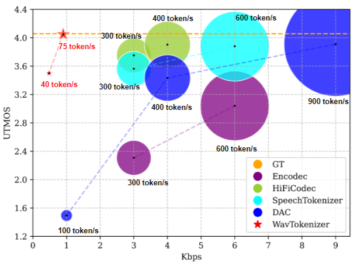

{:.no_toc}

## Overview

Language models have been effectively applied to modeling natural signals, such as images, video, speech, and audio. A crucial component of these models is the codec tokenizer, which compresses high-dimensional natural signals into lower-dimensional discrete tokens. In this paper, we introduce WavTokenizer, which offers several advantages over previous SOTA acoustic codec models in the audio domain: 

1) Extreme Compression. By compressing the layers of quantizers and the temporal dimension of the discrete codec, a one-second audio of 24kHz sampling rate requires only a single quantizer with 40 or 75 tokens.

2) Improved Subjective Quality. Despite the reduced number of tokens, WavTokenizer achieves state-of-the-art reconstruction quality with outstanding UTMOS scores and inherently contains richer semantic information.

Specifically, we achieve these results by designing a broader VQ space, extended contextual windows, and improved attention networks, as well as introducing a powerful multi-scale discriminator and an inverse Fourier transform structure. We conducted extensive reconstruction experiments in the domains of speech, audio, and music. WavTokenizer exhibited strong performance across various objective and subjective metrics compared to state-of-the-art models. We also tested semantic information, VQ utilization, and adaptability to generative models. Comprehensive ablation studies confirm the necessity of each module in WavTokenizer.

## Performance Comparison

Comparison between WavTokenizer and state-of-the-art acoustic codec model. The vertical axis UTMOS represents reconstructed quality closer to human auditory perception, the horizontal axis kbps represents audio compression levels. The size of circles represents the number of discrete tokens per second.

<table>
    <tr>
        <td >
 
</td>
    </tr>
</table>

Figure.1 Performance Comparison.

## Generated Samples

<b>Text:</b> The dull light fell more faintly upon the page whereon another equation began to unfold itself slowly and to spread abroad its widening tail. It was his own soul going forth to experience, unfolding itself sin by sin, spreading abroad the bale fire of its burning stars and folding back upon itself, fading slowly, quenching its own lights and fires. They were quenched: and the cold darkness filled chaos. 

 
<table>
    <tr>
        <th style="text-align: center;"> GT</th>
        <th style="text-align: center;"> WavTokenizer   0.5kbps(Ours)</th>
        <th style="text-align: center;"> WavTokenizer   0.9kbps(Ours)</th>
    </tr>
    <tr>
        <th> <audio controls id="player" onplay="pauseOthers(this);"><source src="assets/audio/GT/1089_134686_000008_000000.wav" type="audio/mpeg"></audio> </th>
        <th> <audio controls id="player" onplay="pauseOthers(this);"><source src="assets/audio/wavtokenizer(0.5kbps)/1089_134686_000008_000000.wav" type="audio/mpeg"></audio> </th>
        <th> <audio controls id="player" onplay="pauseOthers(this);"><source src="assets/audio/wavtokenizer(0.9kbps)/1089_134686_000008_000000.wav" type="audio/mpeg"></audio> </th>
    </tr> 
</table>
 

<b>Text:</b> This was the call of life to his soul not the dull gross voice of the world of duties and despair, not the inhuman voice that had called him to the pale service of the altar. 

 
<table>
    <tr>
        <th style="text-align: center;"> GT</th>
        <th style="text-align: center;"> WavTokenizer   0.5kbps(Ours)</th>
        <th style="text-align: center;"> WavTokenizer   0.9kbps(Ours)</th>
    </tr>
    <tr>
        <th> <audio controls id="player" onplay="pauseOthers(this);"><source src="assets/audio/GT/1089_134691_000035_000001.wav" type="audio/mpeg"></audio> </th>
        <th> <audio controls id="player" onplay="pauseOthers(this);"><source src="assets/audio/wavtokenizer(0.5kbps)/1089_134691_000035_000001.wav" type="audio/mpeg"></audio> </th>
        <th> <audio controls id="player" onplay="pauseOthers(this);"><source src="assets/audio/wavtokenizer(0.9kbps)/1089_134691_000035_000001.wav" type="audio/mpeg"></audio> </th>
    </tr> 
</table>
 

<b>Text:</b> One way led to the left and the other to the right-straight up the mountain. 

 
<table>
    <tr>
        <th style="text-align: center;"> GT</th>
        <th style="text-align: center;"> WavTokenizer   0.5kbps(Ours)</th>
        <th style="text-align: center;"> WavTokenizer   0.9kbps(Ours)</th>
    </tr>
    <tr>
        <th> <audio controls id="player" onplay="pauseOthers(this);"><source src="assets/audio/GT/1284_1180_000007_000001.wav" type="audio/mpeg"></audio> </th>
        <th> <audio controls id="player" onplay="pauseOthers(this);"><source src="assets/audio/wavtokenizer(0.5kbps)/1284_1180_000007_000001.wav" type="audio/mpeg"></audio> </th>
        <th> <audio controls id="player" onplay="pauseOthers(this);"><source src="assets/audio/wavtokenizer(0.9kbps)/1284_1180_000007_000001.wav" type="audio/mpeg"></audio> </th>
    </tr> 
</table>
 

<b>Text:</b> No one saw him do this, for all were looking at the Powder of Life; but soon the woman remembered what she had been doing, and came back to the cupboard. 

 
<table>
    <tr>
        <th style="text-align: center;"> GT</th>
        <th style="text-align: center;"> WavTokenizer   0.5kbps(Ours)</th>
        <th style="text-align: center;"> WavTokenizer   0.9kbps(Ours)</th>
    </tr>
    <tr>
        <th> <audio controls id="player" onplay="pauseOthers(this);"><source src="assets/audio/GT/1284_1181_000023_000002.wav" type="audio/mpeg"></audio> </th>
        <th> <audio controls id="player" onplay="pauseOthers(this);"><source src="assets/audio/wavtokenizer(0.5kbps)/1284_1181_000023_000002.wav" type="audio/mpeg"></audio> </th>
        <th> <audio controls id="player" onplay="pauseOthers(this);"><source src="assets/audio/wavtokenizer(0.9kbps)/1284_1181_000023_000002.wav" type="audio/mpeg"></audio> </th>
    </tr> 
</table>
 

<b>Text:</b> She groped for new ways to teach colored brains and marshal colored thoughts and the result was puzzling both to teacher and student. 

 
<table>
    <tr>
        <th style="text-align: center;"> GT</th>
        <th style="text-align: center;"> WavTokenizer   0.5kbps(Ours)</th>
        <th style="text-align: center;"> WavTokenizer   0.9kbps(Ours)</th>
    </tr>
    <tr>
        <th> <audio controls id="player" onplay="pauseOthers(this);"><source src="assets/audio/GT/1995_1826_000016_000004.wav" type="audio/mpeg"></audio> </th>
        <th> <audio controls id="player" onplay="pauseOthers(this);"><source src="assets/audio/wavtokenizer(0.5kbps)/1995_1826_000016_000004.wav" type="audio/mpeg"></audio> </th>
        <th> <audio controls id="player" onplay="pauseOthers(this);"><source src="assets/audio/wavtokenizer(0.9kbps)/1995_1826_000016_000004.wav" type="audio/mpeg"></audio> </th>
    </tr> 
</table>
 

<b>Text:</b> This may answer, perhaps, in a small place where the manager can gauge pretty closely from actual observation what each customer does; but even then there are elements of risk and waste; and obviously in a large city such a method would soon be likely to result in financial disaster to the plant. 

 
<table>
    <tr>
        <th style="text-align: center;"> GT</th>
        <th style="text-align: center;"> WavTokenizer   0.5kbps(Ours)</th>
        <th style="text-align: center;"> WavTokenizer   0.9kbps(Ours)</th>
    </tr>
    <tr>
        <th> <audio controls id="player" onplay="pauseOthers(this);"><source src="assets/audio/GT/2300_131720_000020_000002.wav" type="audio/mpeg"></audio> </th>
        <th> <audio controls id="player" onplay="pauseOthers(this);"><source src="assets/audio/wavtokenizer(0.5kbps)/2300_131720_000020_000002.wav" type="audio/mpeg"></audio> </th>
        <th> <audio controls id="player" onplay="pauseOthers(this);"><source src="assets/audio/wavtokenizer(0.9kbps)/2300_131720_000020_000002.wav" type="audio/mpeg"></audio> </th>
    </tr> 
</table>
 

<b>Text:</b> There was an average cost per lamp for meter operation of twenty two cents a year, and each meter took care of an average of seventeen lamps. 

 
<table>
    <tr>
        <th style="text-align: center;"> GT</th>
        <th style="text-align: center;"> WavTokenizer   0.5kbps(Ours)</th>
        <th style="text-align: center;"> WavTokenizer   0.9kbps(Ours)</th>
    </tr>
    <tr>
        <th> <audio controls id="player" onplay="pauseOthers(this);"><source src="assets/audio/GT/2300_131720_000022_000003.wav" type="audio/mpeg"></audio> </th>
        <th> <audio controls id="player" onplay="pauseOthers(this);"><source src="assets/audio/wavtokenizer(0.5kbps)/2300_131720_000022_000003.wav" type="audio/mpeg"></audio> </th>
        <th> <audio controls id="player" onplay="pauseOthers(this);"><source src="assets/audio/wavtokenizer(0.9kbps)/2300_131720_000022_000003.wav" type="audio/mpeg"></audio> </th>
    </tr> 
</table>
 

<b>Text:</b> To prevent these electrolytes from freezing we had in each meter a strip of metal. 

 
<table>
    <tr>
        <th style="text-align: center;"> GT</th>
        <th style="text-align: center;"> WavTokenizer   0.5kbps(Ours)</th>
        <th style="text-align: center;"> WavTokenizer   0.9kbps(Ours)</th>
    </tr>
    <tr>
        <th> <audio controls id="player" onplay="pauseOthers(this);"><source src="assets/audio/GT/2300_131720_000025_000005.wav" type="audio/mpeg"></audio> </th>
        <th> <audio controls id="player" onplay="pauseOthers(this);"><source src="assets/audio/wavtokenizer(0.5kbps)/2300_131720_000025_000005.wav" type="audio/mpeg"></audio> </th>
        <th> <audio controls id="player" onplay="pauseOthers(this);"><source src="assets/audio/wavtokenizer(0.9kbps)/2300_131720_000025_000005.wav" type="audio/mpeg"></audio> </th>
    </tr> 
</table>
 

<b>Text:</b> But before it has reached us the rain cloud parts asunder, the sea boils, and the electric fires are brought into violent action by a mighty chemical power that descends from the higher regions. 

 
<table>
    <tr>
        <th style="text-align: center;"> GT</th>
        <th style="text-align: center;"> WavTokenizer   0.5kbps(Ours)</th>
        <th style="text-align: center;"> WavTokenizer   0.9kbps(Ours)</th>
    </tr>
    <tr>
        <th> <audio controls id="player" onplay="pauseOthers(this);"><source src="assets/audio/GT/260_123288_000023_000001.wav" type="audio/mpeg"></audio> </th>
        <th> <audio controls id="player" onplay="pauseOthers(this);"><source src="assets/audio/wavtokenizer(0.5kbps)/260_123288_000023_000001.wav" type="audio/mpeg"></audio> </th>
        <th> <audio controls id="player" onplay="pauseOthers(this);"><source src="assets/audio/wavtokenizer(0.9kbps)/260_123288_000023_000001.wav" type="audio/mpeg"></audio> </th>
    </tr> 
</table>
 

<b>Text:</b> How long are we likely to be separated? Why are we to be denied each other's society? 

 
<table>
    <tr>
        <th style="text-align: center;"> GT</th>
        <th style="text-align: center;"> WavTokenizer   0.5kbps(Ours)</th>
        <th style="text-align: center;"> WavTokenizer   0.9kbps(Ours)</th>
    </tr>
    <tr>
        <th> <audio controls id="player" onplay="pauseOthers(this);"><source src="assets/audio/GT/3575_170457_000010_000001.wav" type="audio/mpeg"></audio> </th>
        <th> <audio controls id="player" onplay="pauseOthers(this);"><source src="assets/audio/wavtokenizer(0.5kbps)/3575_170457_000010_000001.wav" type="audio/mpeg"></audio> </th>
        <th> <audio controls id="player" onplay="pauseOthers(this);"><source src="assets/audio/wavtokenizer(0.9kbps)/3575_170457_000010_000001.wav" type="audio/mpeg"></audio> </th>
    </tr> 
</table>
 

<b>Text:</b> She makes effort after effort, trembling with eagerness, and when she fails to reproduce what she sees, she works herself into a frenzy of grief and disappointment." 

 
<table>
    <tr>
        <th style="text-align: center;"> GT</th>
        <th style="text-align: center;"> WavTokenizer   0.5kbps(Ours)</th>
        <th style="text-align: center;"> WavTokenizer   0.9kbps(Ours)</th>
    </tr>
    <tr>
        <th> <audio controls id="player" onplay="pauseOthers(this);"><source src="assets/audio/GT/4992_41797_000017_000002.wav" type="audio/mpeg"></audio> </th>
        <th> <audio controls id="player" onplay="pauseOthers(this);"><source src="assets/audio/wavtokenizer(0.5kbps)/4992_41797_000017_000002.wav" type="audio/mpeg"></audio> </th>
        <th> <audio controls id="player" onplay="pauseOthers(this);"><source src="assets/audio/wavtokenizer(0.9kbps)/4992_41797_000017_000002.wav" type="audio/mpeg"></audio> </th>
    </tr> 
</table>
 

<b>Text:</b> 'You know Captain Lake?' said Lord Chelford, addressing me. 

 
<table>
    <tr>
        <th style="text-align: center;"> GT</th>
        <th style="text-align: center;"> WavTokenizer   0.5kbps(Ours)</th>
        <th style="text-align: center;"> WavTokenizer   0.9kbps(Ours)</th>
    </tr>
    <tr>
        <th> <audio controls id="player" onplay="pauseOthers(this);"><source src="assets/audio/GT/5683_32865_000004_000000.wav" type="audio/mpeg"></audio> </th>
        <th> <audio controls id="player" onplay="pauseOthers(this);"><source src="assets/audio/wavtokenizer(0.5kbps)/5683_32865_000004_000000.wav" type="audio/mpeg"></audio> </th>
        <th> <audio controls id="player" onplay="pauseOthers(this);"><source src="assets/audio/wavtokenizer(0.9kbps)/5683_32865_000004_000000.wav" type="audio/mpeg"></audio> </th>
    </tr> 
</table>
 

<b>Text:</b> For the ideas and generalizations thus mainly formed from the images and impressions received in childhood become, in later years, the elements of the machinery, so to speak, by which all his mental operations are performed. 

 
<table>
    <tr>
        <th style="text-align: center;"> GT</th>
        <th style="text-align: center;"> WavTokenizer   0.5kbps(Ours)</th>
        <th style="text-align: center;"> WavTokenizer   0.9kbps(Ours)</th>
    </tr>
    <tr>
        <th> <audio controls id="player" onplay="pauseOthers(this);"><source src="assets/audio/GT/7021_79759_000008_000000.wav" type="audio/mpeg"></audio> </th>
        <th> <audio controls id="player" onplay="pauseOthers(this);"><source src="assets/audio/wavtokenizer(0.5kbps)/7021_79759_000008_000000.wav" type="audio/mpeg"></audio> </th>
        <th> <audio controls id="player" onplay="pauseOthers(this);"><source src="assets/audio/wavtokenizer(0.9kbps)/7021_79759_000008_000000.wav" type="audio/mpeg"></audio> </th>
    </tr> 
</table>
 

<b>Text:</b> He was such a big boy that he wore high boots and carried a jack knife. He gazed and gazed at the cap, and could not keep from fingering the blue tassel. 

 
<table>
    <tr>
        <th style="text-align: center;"> GT</th>
        <th style="text-align: center;"> WavTokenizer   0.5kbps(Ours)</th>
        <th style="text-align: center;"> WavTokenizer   0.9kbps(Ours)</th>
    </tr>
    <tr>
        <th> <audio controls id="player" onplay="pauseOthers(this);"><source src="assets/audio/GT/7021_85628_000008_000001.wav" type="audio/mpeg"></audio> </th>
        <th> <audio controls id="player" onplay="pauseOthers(this);"><source src="assets/audio/wavtokenizer(0.5kbps)/7021_85628_000008_000001.wav" type="audio/mpeg"></audio> </th>
        <th> <audio controls id="player" onplay="pauseOthers(this);"><source src="assets/audio/wavtokenizer(0.9kbps)/7021_85628_000008_000001.wav" type="audio/mpeg"></audio> </th>
    </tr> 
</table>
 

<b>Text:</b> This was a formidable array of advantages; slavery was playing with loaded dice. 

 
<table>
    <tr>
        <th style="text-align: center;"> GT</th>
        <th style="text-align: center;"> WavTokenizer   0.5kbps(Ours)</th>
        <th style="text-align: center;"> WavTokenizer   0.9kbps(Ours)</th>
    </tr>
    <tr>
        <th> <audio controls id="player" onplay="pauseOthers(this);"><source src="assets/audio/GT/7729_102255_000002_000010.wav" type="audio/mpeg"></audio> </th>
        <th> <audio controls id="player" onplay="pauseOthers(this);"><source src="assets/audio/wavtokenizer(0.5kbps)/7729_102255_000002_000010.wav" type="audio/mpeg"></audio> </th>
        <th> <audio controls id="player" onplay="pauseOthers(this);"><source src="assets/audio/wavtokenizer(0.9kbps)/7729_102255_000002_000010.wav" type="audio/mpeg"></audio> </th>
    </tr> 
</table>
 

<b>Text:</b> Great pains were taken by the Scots (and the English complied with their pretended delicacy) to make this estimation and payment of arrears appear a quite different transaction from that for the delivery of the king's person: but common sense requires that they should be regarded as one and the same. 

 
<table>
    <tr>
        <th style="text-align: center;"> GT</th>
        <th style="text-align: center;"> WavTokenizer   0.5kbps(Ours)</th>
        <th style="text-align: center;"> WavTokenizer   0.9kbps(Ours)</th>
    </tr>
    <tr>
        <th> <audio controls id="player" onplay="pauseOthers(this);"><source src="assets/audio/GT/8224_274384_000028_000000.wav" type="audio/mpeg"></audio> </th>
        <th> <audio controls id="player" onplay="pauseOthers(this);"><source src="assets/audio/wavtokenizer(0.5kbps)/8224_274384_000028_000000.wav" type="audio/mpeg"></audio> </th>
        <th> <audio controls id="player" onplay="pauseOthers(this);"><source src="assets/audio/wavtokenizer(0.9kbps)/8224_274384_000028_000000.wav" type="audio/mpeg"></audio> </th>
    </tr> 
</table>
 

<b>Text:</b> The study of any topic is like the continued observation of an object which is approaching us along a road: what is certain to begin with is the quite vague knowledge that there is some object on the road. 

 
<table>
    <tr>
        <th style="text-align: center;"> GT</th>
        <th style="text-align: center;"> WavTokenizer   0.5kbps(Ours)</th>
        <th style="text-align: center;"> WavTokenizer   0.9kbps(Ours)</th>
    </tr>
    <tr>
        <th> <audio controls id="player" onplay="pauseOthers(this);"><source src="assets/audio/GT/8230_279154_000018_000002.wav" type="audio/mpeg"></audio> </th>
        <th> <audio controls id="player" onplay="pauseOthers(this);"><source src="assets/audio/wavtokenizer(0.5kbps)/8230_279154_000018_000002.wav" type="audio/mpeg"></audio> </th>
        <th> <audio controls id="player" onplay="pauseOthers(this);"><source src="assets/audio/wavtokenizer(0.9kbps)/8230_279154_000018_000002.wav" type="audio/mpeg"></audio> </th>
    </tr> 
</table>
 

<b>Text:</b> At any rate, my eloquence was altogether stopped. The gentleman was named Sir Ferdinando Brown. 

 
<table>
    <tr>
        <th style="text-align: center;"> GT</th>
        <th style="text-align: center;"> WavTokenizer   0.5kbps(Ours)</th>
        <th style="text-align: center;"> WavTokenizer   0.9kbps(Ours)</th>
    </tr>
    <tr>
        <th> <audio controls id="player" onplay="pauseOthers(this);"><source src="assets/audio/GT/8455_210777_000022_000007.wav" type="audio/mpeg"></audio> </th>
        <th> <audio controls id="player" onplay="pauseOthers(this);"><source src="assets/audio/wavtokenizer(0.5kbps)/8455_210777_000022_000007.wav" type="audio/mpeg"></audio> </th>
        <th> <audio controls id="player" onplay="pauseOthers(this);"><source src="assets/audio/wavtokenizer(0.9kbps)/8455_210777_000022_000007.wav" type="audio/mpeg"></audio> </th>
    </tr> 
</table>
 

<b>Text:</b> These plumes waved gracefully in the air with every mincing step the Princesses took. 

 
<table>
    <tr>
        <th style="text-align: center;"> GT</th>
        <th style="text-align: center;"> WavTokenizer   0.5kbps(Ours)</th>
        <th style="text-align: center;"> WavTokenizer   0.9kbps(Ours)</th>
    </tr>
    <tr>
        <th> <audio controls id="player" onplay="pauseOthers(this);"><source src="assets/audio/GT/8555_284447_000020_000002.wav" type="audio/mpeg"></audio> </th>
        <th> <audio controls id="player" onplay="pauseOthers(this);"><source src="assets/audio/wavtokenizer(0.5kbps)/8555_284447_000020_000002.wav" type="audio/mpeg"></audio> </th>
        <th> <audio controls id="player" onplay="pauseOthers(this);"><source src="assets/audio/wavtokenizer(0.9kbps)/8555_284447_000020_000002.wav" type="audio/mpeg"></audio> </th>
    </tr> 
</table>
 

<b>Text:</b> Then they rolled the frame in position underneath the Great Knife and Trot held in her hand the cord which would release it. 

 
<table>
    <tr>
        <th style="text-align: center;"> GT</th>
        <th style="text-align: center;"> WavTokenizer   0.5kbps(Ours)</th>
        <th style="text-align: center;"> WavTokenizer   0.9kbps(Ours)</th>
    </tr>
    <tr>
        <th> <audio controls id="player" onplay="pauseOthers(this);"><source src="assets/audio/GT/8555_284447_000066_000000.wav" type="audio/mpeg"></audio> </th>
        <th> <audio controls id="player" onplay="pauseOthers(this);"><source src="assets/audio/wavtokenizer(0.5kbps)/8555_284447_000066_000000.wav" type="audio/mpeg"></audio> </th>
        <th> <audio controls id="player" onplay="pauseOthers(this);"><source src="assets/audio/wavtokenizer(0.9kbps)/8555_284447_000066_000000.wav" type="audio/mpeg"></audio> </th>
    </tr> 
</table>
 